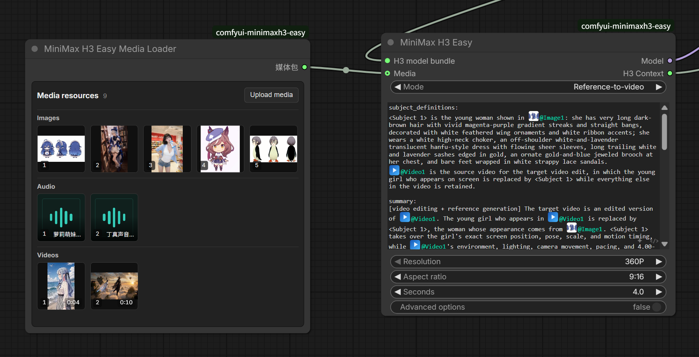
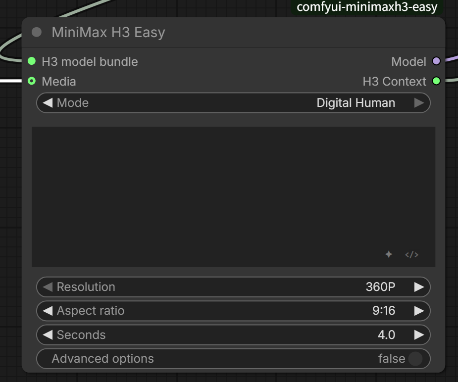
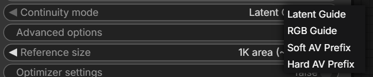
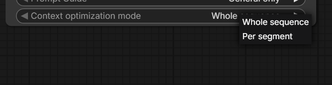

# ComfyUI-MiniMaxH3-Easy

[中文说明](README_CN.md)

A practical MiniMax H3 node suite for ComfyUI. It reduces the setup needed for text-to-video, image-to-video, first/last-frame generation, reference-to-video, digital humans, and long context-segment videos, while adding unified media management, visual prompt references, prompt optimization, and per-segment refinement.

<p align="center">
  
</p>

## Why use it?

- **One main node for common generation modes**: text, image, first/last frame, full reference, and digital human.
- **Unified image, video, and audio management**: upload, preview, reorder, replace, and remove media in one visual Media Loader. Video cards show their duration.
- **Reference media directly in the prompt**: type `@` to insert an image, video, or audio reference without manually writing `<Picture N>` tags.
- **Generate longer videos as connected segments**: every segment keeps its own prompt and references while receiving visual or AV context from the previous segment.
- **Built-in segment refinement**: Pixel Resize, 3D Latent Upscale, and a Low VRAM Tile option.
- **Still fully composable**: samplers, LoRAs, attention patches, decoders, and save nodes remain ordinary ComfyUI connections.

## Installation

First update ComfyUI to a recent version that includes the official MiniMax H3 nodes.

Install inside `ComfyUI/custom_nodes`:

```bash
git clone https://github.com/nkxx188/ComfyUI-MiniMaxH3-Easy.git
```

You can also search for `ComfyUI-MiniMaxH3-Easy` in ComfyUI Manager. **Select the Nightly version during installation, because Nightly is the current up-to-date release**; other published versions may lag behind this repository. Restart ComfyUI after installing or updating Python files.

Place the regular models in:

```text
ComfyUI/models/diffusion_models/
ComfyUI/models/text_encoders/
ComfyUI/models/vae/
```

For a Latent Upscale refinement, place the matching H3 3D latent upscaler in:

```text
ComfyUI/models/latent_upscale_models/
```

The Easy Loader can select FL2VA, Ref2VA, the text encoder, and both VAEs directly. Its filename whitelist and naming filters have been removed, so it shows every available file from the corresponding ComfyUI model directories; select the correct file for each role. Other native, community, or GGUF loaders can also be connected through **MiniMax H3 Easy Model Adapter**.

## Quick start

The fastest route is to import [`workflow/1.MiniMax_H3_Easy.json`](workflow/1.MiniMax_H3_Easy.json), then:

1. Select the models in **MiniMax H3 Easy Loader**.
2. Select a mode in **MiniMax H3 Easy**.
3. Enter a prompt and connect any required image, video, or audio media.
4. Choose the resolution, aspect ratio, and duration.
5. Queue the workflow.

For a manual setup, the basic structure is:

```text
Easy Loader → MiniMax H3 Easy → Easy Output → sample / decode / save
```

The main node's `Model` output can continue through LoRAs, model patches, or a sampler. Connect `H3 Context` to **MiniMax H3 Easy Output**.

## Generation modes

| Goal | Mode and input |
|---|---|
| Text-to-video | Select either `I2V or First/Last Frame` or `Reference-to-video`, and connect no media |
| Image-to-video | Select `I2V or First/Last Frame` and connect 1 image |
| First/last-frame video | Select `I2V or First/Last Frame` and connect 2 images |
| Reference-to-video | Select `Reference-to-video` and connect images, videos, or standalone audio; at least one image or video is required |
| Digital human | Select `Digital Human` and connect visual references plus exactly one driving audio track |

First/last-frame images are center-cropped when needed to fit the selected canvas. They are not stretched horizontally or vertically.

Both `I2V or First/Last Frame` and `Reference-to-video` automatically become text-to-video when no media is connected, so text generation is not tied to only one mode.

When both FL2VA and Ref2VA are configured, regular text/image generation prefers FL2VA and full-reference generation prefers Ref2VA. If only one transformer is configured, that model serves every mode.

### Digital Human

Digital Human mode locks the single Media audio item into the generated result as its driving track; it is no longer treated as ordinary reference audio. Visual references may be images or videos. If no audio is supplied, the node automatically falls back to ordinary reference-to-video instead of failing.

<p align="center">
  
</p>

## Media and prompt editing

### Four ways to provide media

| Method | Best for |
|---|---|
| **Media Loader** | Recommended daily use; manage media in one place with decoded-video reference caching |
| **Direct Media-port links** | Connect ordinary image, video, and audio nodes; one visible port accepts multiple virtual links |
| **Media Bridge** | Workflow API, headless execution, or workflows that need explicit numbered inputs |
| **Media Splitter** | Split one Media Bundle into standalone image, video, and audio outputs for other workflows |

Media Loader can hold a large shared library; the consuming Easy or Context Segments node applies the actual media limits. **Of the four methods, only Media Loader caches decoded video references.** After a video is decoded once, later generations can reuse it through ComfyUI's node cache, reducing the loading and decoding time when the same reference video is used repeatedly. Replacing or modifying the file invalidates the cache automatically. Direct Media-port links, Media Bridge, and Media Splitter do not provide this decoded-video cache. It saves video preparation time, not the model's sampling time.

`Media Splitter` is the reverse utility of Media Loader / Media Bridge: it expands one `Media Bundle` into standard `IMAGE`, `VIDEO`, and `AUDIO` outputs. Set the three counts and only that many output ports are shown; unused ports do not take up canvas space. This makes it useful for sending one shared media library into other ComfyUI workflows.

With direct Media links, drag from the port to an empty area to create a compatible media node, or click a virtual-link number to remove that item.

<p align="center">
  
</p>

### `@` media references

Type `@` in a reference or context prompt to select a connected image, video, or audio item. References can be displayed by index or filename and are converted to the H3 tags required at runtime.

Images, videos, and audio clips have independent numbering, so `@Image1`, `@Video1`, and `@Audio1` can all exist together.

<p align="center">
  
</p>

### Dialogue blocks and raw view

Type `#` to create a dialogue block. It is converted to `<d>...</d>` at runtime. The controls at the bottom-right of the editor open prompt optimization and switch between the structured and raw prompt views.

<p align="center">
  
</p>

The prompt can also be converted into a normal `STRING` input. When external text is connected, the built-in editor becomes read-only and the external string is used as the prompt.

## Long videos with Context Segments

Context Segments divides a longer video into connected shots. Each segment keeps its own prompt, duration, and reference media while receiving continuity information from the previous segment.

The basic pipeline is:

```text
Context Segments → Segment Sample → Segment Decode → first-pass video
                         ↓
                  Segment Refine → Segment Decode → refined video
```

### Basic usage

1. Separate prompts with a standalone `---` line. In the structured editor, type `~` to insert this divider automatically.
2. Enter matching durations in `Segment seconds`, for example `5,5,5`.
3. Use `@` to assign the required media to each segment.
4. Select a continuity mode and context-frame count.
5. Connect `H3 Context` to **Segment Sample**.

Regular first-pass workflow:

- [`4.MiniMax_H3_Easy_Context_Segments.json`](workflow/4.MiniMax_H3_Easy_Context_Segments.json)

### Optional per-segment control

If you only want one chain that generates every segment, use **Segment Sample**. To adjust seeds per segment, temporarily replace one segment's prompt, or optionally rerun only the affected part later, use [`7.MiniMax_H3_Easy_Context_Segments_Control.json`](workflow/7.MiniMax_H3_Easy_Context_Segments_Control.json). It connects the shared Context, Model, SAMPLER, and SIGMAS once through **MiniMax H3 Easy Sample Setup**, then chains multiple **Segment Step** nodes. The first run still generates the complete video; selective reruns are an extra capability.

The first Step receives Setup; later Steps only connect `Previous segment`, and the segment order is inferred from the chain. Each Step has its own seed, while `Prompt override` is optional. If it is not connected, the Step keeps using the segment prompt and `@` media from Context Segments. The example contains 3 Steps; add or remove Steps as needed.

### Segment prompts and reference media

All media connected to Context Segments forms one shared library, but it is not automatically used by every segment. **A segment directly uses only the images, videos, or audio explicitly referenced with `@` inside that segment's prompt.** References are not inherited from the previous segment, so repeat the `@` reference in every segment that needs the same asset.

Media not referenced by the current segment is not sent into that segment's generation, preventing references from different shots from interfering with one another. At runtime, the editor converts visible `@` mentions into H3 tags and renumbers them for the subset used by that segment. A segment without a direct media reference can still receive continuity from the previous segment through the selected continuity mode.

### Continuity modes

| Mode | What it carries | Context frames |
|---|---|---|
| **Latent Guide** | Passes the previous segment's video latent directly; usually the best starting point | `5 / 22 / 39 / 56 / 73` |
| **RGB Guide** | Re-encodes the previous tail as a multi-frame visual Guide | `5 / 22 / 39 / 56 / 73` |
| **Soft AV Prefix** | Carries both video and audio prefixes, with a softer audio release at the boundary | `39 / 90 / 141` |
| **Hard AV Prefix** | Strictly preserves the overlapping video and audio prefixes | `39 / 90 / 141` |

<p align="center">
  
</p>

For speaker or singer identity, prefer an AV Prefix mode or supply a clear audio reference. RGB Guide mainly carries visual boundary information and cannot reliably lock voice timbre by itself.

Context Segments also supports Digital Human audio mode. Connect exactly one audio item and it will be sliced across the full timeline and used as the final complete soundtrack.

### Per-segment refinement

**MiniMax H3 Easy Segment Refine** upscales and resamples one segment at a time while continuing to pass the refined result into the following segment. Prompts and reference media from different shots therefore remain separate.

- **Pixel Resize**: decode, resize, and re-encode; no latent upscaler model is required.
- **Latent Upscale**: use the built-in 3D latent upscaler instead of pixel resizing.
- **Low VRAM Tile**: spatially tile the current segment to trade more sampling time for lower VRAM use.

Example workflows:

- [`6.MiniMax_H3_Easy_Context_Segments_Pixel_Refine.json`](workflow/6.MiniMax_H3_Easy_Context_Segments_Pixel_Refine.json)
- [`5.MiniMax_H3_Easy_Context_Segments_Latent_Refine.json`](workflow/5.MiniMax_H3_Easy_Context_Segments_Latent_Refine.json)

Segment Decode decodes one segment at a time into a temporary video file and returns a complete ComfyUI `VIDEO` with audio. It does not keep the full RGB timeline in memory.

## Prompt optimization

Enable Prompt optimizer under the node's Advanced options, then fill in the API format, URL, key, and model directly in that node. Click `✦` at the bottom-right of the prompt editor to optimize manually, or enable automatic optimization when the workflow runs. Supported API formats are:

- OpenAI-compatible Chat Completions;
- OpenAI Responses;
- Gemini Native.

The optimizer also supports:

- optional connected-media reading;
- mode-specific MiniMax H3 Prompt Guides.

<p align="center">
  
</p>

### Context-specific optimization

`Segment seconds` also tells the optimizer how many prompts to produce. For example, with `5,5,5`, you can enter one undivided story or idea and click `✦` (or enable optimization on run). The optimizer will turn it into exactly **3 standalone prompts**, separated automatically by `---`.

- **Whole sequence**: understands the entire video in one request. It can turn one idea into a beginning, development, and ending, or improve an existing segmented script while preserving each segment's intended action and order.
- **Per segment**: designed for an existing multi-segment draft. Segments are optimized separately with configurable concurrency; earlier original segments are supplied only as read-only continuity context, while only the current segment is rewritten.

This is more than generic prompt expansion. The optimizer adapts action density to each duration, carries the necessary subject appearance, setting, prop state, and audio cues into standalone prompts, and avoids planning phrases such as “Segment 2” or “continue from the previous clip.” When media reading is enabled, it also preserves or assigns `@` references only where they are relevant. Generation still strictly follows the rule that each segment uses only the media referenced inside that segment.

Automatic optimization records prompts it has already processed. If the prompt, optimizer settings, and media are unchanged, it does not rewrite the prompt again on every run.

<p align="center">
  
</p>

API settings belong to each node and are serialized into the workflow. This makes a workflow self-contained, but the API key is also stored as plain text inside the workflow JSON. Clear the key before sharing or publishing a workflow.

## Node reference

| Node | Purpose |
|---|---|
| MiniMax H3 Easy Loader | Select H3 transformers, the text encoder, and both VAEs |
| MiniMax H3 Easy Model Adapter | Use external MODEL, CLIP, and VAE loaders |
| MiniMax H3 Easy Media Loader | Visually manage images, audio, and video |
| MiniMax H3 Easy Media Bridge | Provide explicit media inputs for API or headless workflows |
| MiniMax H3 Easy Media Splitter | Split a Media Bundle into standalone IMAGE, VIDEO, and AUDIO outputs; up to 27 images, 9 videos, and 9 audio clips |
| MiniMax H3 Easy | Regular generation, reference generation, and Digital Human |
| MiniMax H3 Easy Output | Expand H3 Context into conditioning, latent, VAEs, FPS, and driving audio |
| MiniMax H3 Easy Context Segments | Build a long-video segment plan |
| MiniMax H3 Easy Segment Sample | Run the first-pass segment chain |
| MiniMax H3 Easy Sample Setup | Provide shared sampling settings once for per-segment workflows |
| MiniMax H3 Easy Segment Step | Process one segment with an independent seed and optional prompt override |
| MiniMax H3 Easy Segment Collect | Collect the chained segment results |
| MiniMax H3 Easy Segment Refine | Run Pixel or Latent per-segment refinement |
| MiniMax H3 Easy Segment Decode | Stream-decode and return a complete VIDEO |
| MiniMax H3 Easy Aspect Ratio | Pass the first-pass aspect ratio to downstream resolution controls |
| MiniMax H3 Easy Second Pass Conditioning | Rebuild resolution-bound conditioning for an external second pass |
| MiniMax H3 Easy 3D Latent Upscale | Built-in H3 video-latent upscaler |

## Limits and notes

- A regular reference generation can use up to 9 images, 3 videos, and 3 standalone audio clips, with 15 media items total.
- The Context Segments shared library accepts up to 27 images, 9 videos, and 9 audio clips. Each individual segment still follows the regular per-call reference limits.
- Digital Human mode accepts only one driving audio track.
- Media Loader caches decoded frames. Long or high-resolution reference videos can use substantial system RAM.
- The regular Segment Sample and Segment Refine nodes currently execute again on every queue, even when their seed and inputs are unchanged; the per-segment control workflow can use ComfyUI's native cache for unchanged preceding Steps.
- Segment Decode requires FFmpeg. The project prefers `imageio-ffmpeg` and can also use FFmpeg from the system PATH.
- Prompt optimization is optional and is not required for generation.

## Additional information

- Both the classic ComfyUI canvas and Nodes 2.0 are supported.
- Chinese browser environments display Chinese labels; other environments default to English.
- Example workflows are available in [`workflow`](workflow). Some workflows may require additional models, LoRAs, or custom nodes.

## Acknowledgements

The context-continuity design was inspired by [NikoDemon80/ComfyUI-H3-Motion-Context](https://github.com/NikoDemon80/ComfyUI-H3-Motion-Context) and its derivative project [ethanfel/ComfyUI-MiniMaxH3-Contex-Loop](https://github.com/ethanfel/ComfyUI-MiniMaxH3-Contex-Loop); the code and node implementation were developed independently.

## License and attribution

This project is released under the [MIT License](LICENSE).

If your project reuses or adapts a substantial amount of this project's code or major implementations, please credit the original author and mention `ComfyUI-MiniMaxH3-Easy`. Please do not present the reused portions as entirely independent original work. Minor references, ordinary use, or simply depending on this node do not carry this attribution request.
