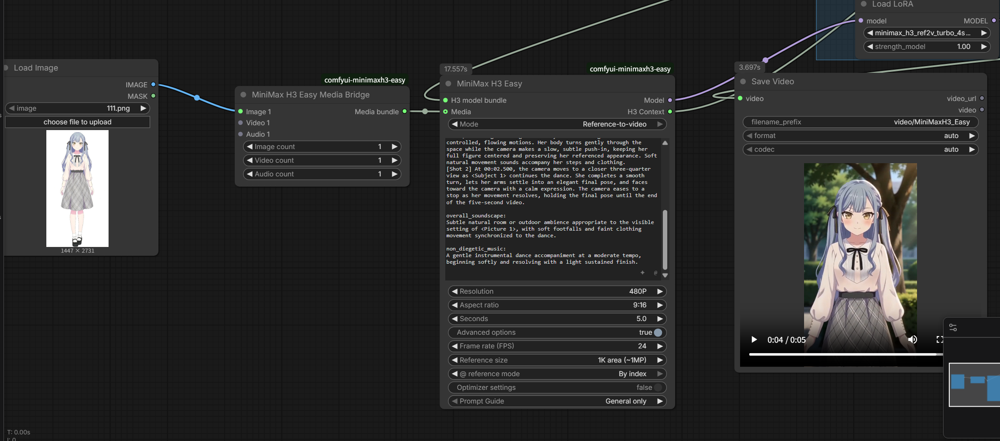

# ComfyUI-MiniMaxH3-Easy

[中文说明 / Chinese documentation](README_CN.md)

`ComfyUI-MiniMaxH3-Easy` provides a compact MiniMax H3 workflow surface for
text-to-video, image-to-video, first/last-frame generation, and full-reference
video generation in ComfyUI.

The main node keeps one multi-link `Media` port instead of exposing a fixed
row of image, video, and audio inputs. It also includes an `@` reference
editor, structured dialogue blocks, a literal raw-prompt view, external text
input support, mode-aware Prompt Guides, and optional API-based prompt
optimization.

The sampler, LoRA and attention patches, decoding, video assembly, and save
nodes remain outside the main node so the workflow continues to work with the
rest of the ComfyUI ecosystem.

## Highlights

### One multi-link `Media` input

Images, videos, and standalone audio clips connect to the same visible
`Media` port. Multiple links can enter that port at once.

- Images, videos, and audio are numbered independently.
- Each media type has its own wire color and preview treatment.
- Link order is retained when the workflow is saved and loaded.
- Dragging left from `Media` to empty canvas opens a quick-create menu for
  compatible media loader nodes.
- Clicking the number on a virtual media wire opens its delete menu.

<p align="center">
  
</p>

<p align="center">
  
</p>

The visible single port is intentional. The frontend transports the ordered
links through hidden execution inputs without turning the node back into a
large set of fixed sockets.

### Workflow API and headless execution

The multi-link `Media` interface is designed for normal browser-based ComfyUI
use. When a workflow is submitted through the ComfyUI API, a headless runner,
or another server-side executor, use **MiniMax H3 Easy Media Bridge** to make
the media inputs explicit:

1. Set the image, video, and audio counts.
2. Connect each source to its matching numbered input.
3. Connect `Media bundle` to the main Easy node's `Media` input.

<p align="center">
  
</p>

For normal canvas workflows, continue connecting media directly to `Media`.

### `@` media references

In **Reference Video** mode, type `@` to select a connected image, video, or
standalone audio resource. The picker shows images first, videos second, and
audio last, with available previews.

<p align="center">
  
</p>

<p align="center">
  
</p>

References can be displayed by index or filename. At execution time they are
converted to MiniMax H3 tags such as `<Picture N>`, `<Video N>`, and
`<Audio N>`.

Video soundtracks remain paired with their source video. Standalone audio is
numbered separately. When the relationship would otherwise be ambiguous, the
node adds the video/audio provenance to the runtime prompt.

A disconnected `@` reference remains visible instead of being silently
deleted, and a mismatch between the number of references and connected media
does not block workflow execution. Reconnecting or removing stale references
is the user's responsibility.

### Dialogue blocks and raw prompt view

Type `#` in the structured editor to create a dialogue block.

<p align="center">
  
</p>

- `Enter` exits the dialogue block.
- `Shift+Enter` inserts a line break inside it.
- The block is serialized as `<d>...</d>`.
- Dialogue and lyric language is preserved; it is not forced to Chinese.

Use the `@` / `</>` button in the lower-right corner to switch between the
structured editor and the literal raw prompt. Raw mode displays the actual
`<Picture N>`, `<Video N>`, `<Audio N>`, and `<d>...</d>` text without
rendering chips or dialogue blocks.

### Native text input behavior

The prompt widget can be converted to an input and connected to a normal
ComfyUI `STRING` node. While an external text link is connected:

- the custom editor becomes read-only;
- the linked string is used as the prompt;
- internal editor text is not appended to it;
- prompt optimization is disabled for that editor.

`Ctrl+S` / `Cmd+S` synchronizes the editor and allows ComfyUI's normal workflow
save shortcut to run. Native typing, Backspace, undo/redo, and canvas zoom
behavior remain available.

## Prompt optimization

Click the `✦` button in the prompt editor to rewrite the current prompt with a
configured API. During the request, the editor shows an activity indicator and
elapsed time.

The optimizer supports:

- OpenAI-compatible Chat Completions APIs;
- OpenAI Responses APIs;
- Gemini Native `generateContent` APIs;
- configurable API URL, API key, and model name;
- mode-aware MiniMax H3 Prompt Guides;
- optional reading of connected media;
- optional optimization when the workflow runs;
- a 600-second request timeout;
- a requested maximum output of 50,000 tokens.

The actual output limit is still controlled by the selected model and API
provider. Providers with a lower limit may truncate the response or reject the
requested value.

### Workflow API settings

Enable **Advanced options**, then enable **Prompt optimizer** to show its
workflow parameters:

- API format: OpenAI Compatible, OpenAI Responses, or Gemini Native;
- API URL;
- API Key;
- model name;
- Read connected media;
- Optimize when workflow runs.

The API key may be left empty for OpenAI-compatible and Responses endpoints
that do not require authentication, such as a local LM Studio server.

All of these settings, including the selected **Prompt Guide**, are stored as
ordinary node parameters in the workflow. The API Key is visually masked in the
node, but remains plain text in the workflow JSON. Keep workflow files private
when they contain credentials.

**Optimize when workflow runs** is disabled by default. When enabled, the node
optimizes the prompt before building the H3 conditioning. Missing settings or
API errors fall back to the original prompt so the workflow can continue. A
successful result is written back to the prompt editor and is not optimized
again while the prompt, selected guide, API context, and connected media remain
unchanged. Clicking the `✦` button still performs a manual optimization.

### Prompt Guide selection

The optimizer always loads the general H3 rules, then selects the correct mode
guide:

- I2V / First/Last Frame mode uses the base T2VA, I2VA, FL2VA, and L2VA guide.
- Reference Video mode uses the full-reference Ref2VA guide.
- The selected scene guide and its reference files are appended when present.

Included scene guides currently cover 3D animation shorts, brand promos,
co-op game intros, hand-drawn/live-action fusion, minimalist product ads,
music-video subtitles, paper collage, and papercraft stop motion.

### Connected media and evidence rules

When **Read connected media** is enabled, locally resolvable files up to 32 MiB
each may be attached to the optimization request:

- Gemini Native can receive image, video, and audio inline parts.
- OpenAI-compatible Chat Completions and OpenAI Responses requests currently attach images only.
- Unsupported, missing, or oversized files are skipped.

The system prompt explicitly tells the optimizer not to invent media content.
If no file is attached, or the selected model cannot perceive the supplied
modality, it must preserve relevant tags and reason only from the user's text
and explicit instructions.

### Re-optimization

If the current editor text is exactly the previous optimizer result, clicking
`✦` again regenerates from the original source prompt rather than repeatedly
rewriting the generated result. Once the result is manually edited, the edited
text becomes the next source prompt.

## Nodes

### MiniMax H3 Easy Loader

The bundled loader selects:

- FL2VA transformer;
- Ref2VA transformer;
- Qwen3-VL text encoder;
- video VAE;
- audio VAE.

One transformer may be set to `None`. The remaining transformer then serves
all modes. When both filenames are configured, FL2VA is preferred for text,
image, and keyframe generation, while Ref2VA is preferred for full-reference
generation.

Transformer files are loaded on demand. When the requested mode changes to a
different transformer file, the loader releases its cached transformer and
asks ComfyUI to empty the soft cache before loading the other one.

The filename matcher recognizes common community naming and quantization
variants, including `.safetensors` and `.gguf` releases.

### MiniMax H3 Easy Model Bridge

The Model Bridge assembles ordinary ComfyUI loader outputs into an H3 bundle.
It accepts:

- required `CLIP`, video `VAE`, and audio `VAE` inputs;
- optional FL2VA `MODEL`;
- optional Ref2VA `MODEL`;
- one or both transformer models.

This allows native, community, and GGUF loaders to be used instead of the
bundled loader. If upstream nodes load both transformer models, both may remain
resident according to ComfyUI's model-management behavior. Connect only one
transformer when minimizing memory use is more important than automatic
per-mode model selection.

### MiniMax H3 Easy

The main node handles prompt editing, media ordering, dimensions, duration,
mode selection, conditioning, and latent preparation. It outputs:

- `Model`: connect to a model-only LoRA, attention patch, accelerator, or
  sampler;
- `H3 Context`: connect to **MiniMax H3 Easy Output**.

### MiniMax H3 Easy Output

This node expands `H3 Context` into standard workflow outputs:

- Conditioning;
- Latent;
- Video VAE;
- Audio VAE;
- FPS.

### MiniMax H3 Easy Aspect Ratio

This utility reads the resolved aspect ratio from `H3 Context` and exposes the
matching `ResolutionSelector` label, such as `16:9 (Widescreen)`. It synchronizes
only the ratio: downstream megapixels, multiples, and exact width/height remain
independent. This is useful for Pass 2 workflows where the second pass must keep
the first pass composition ratio while rendering at a different pixel budget.

### MiniMax H3 Easy Second Pass Conditioning

This node prepares conditioning for a resolution-changing second pass. Connect:

- `h3_context` to the main **MiniMax H3 Easy** node;
- `second_pass_video_latent` to the 24-channel video-only latent produced by the
  second-pass `VAEEncode`, before it is joined with audio;
- `second_pass_positive` to the second pass `BasicGuider`.

For text-to-video and pure reference generation, the node copies the existing
conditioning without removing mode-specific metadata. For I2V and first/last
frame generation, it resizes the original keyframe images to the actual
second-pass latent canvas and re-encodes them with the H3 video VAE. Reference
blocks in `minimax_refs`, text conditioning, token tags, frame indexes, and other
metadata are preserved. This prevents the keyframe row-count mismatch that
occurs when first-pass keyframe latents are reused at a different resolution.

## Pass 2 workflow

[`MiniMax_H3_Easy_Pass2.json`](workflow/MiniMax_H3_Easy_Pass2.json) is the
included two-stage refinement workflow. It uses the first model to establish
motion, timing, composition, and audio, then uses a smaller pruned W4A8 H3 model
to refine the upscaled video at a lower denoise value.

The workflow:

1. runs the first pass with the Easy loader, Turbo LoRA, and the selected H3
   mode;
2. separates the first-pass AV latent so the original audio latent can be
   reused;
3. decodes and resizes only the video, then encodes it at the independent Pass 2
   megapixel target;
4. rebuilds resolution-bound I2V/FL2V keyframes while preserving reference
   media conditioning;
5. rejoins the new video latent with the original audio latent and performs the
   second sample.

The included starting values are 8 steps at full denoise for Pass 1 and 3 steps
at `0.25` denoise for Pass 2. They are presets rather than fixed requirements.
The ratio is synchronized automatically from **MiniMax H3 Easy**, while the Pass
2 megapixel target remains independently adjustable.

The workflow supports T2V, I2V, first/last frame, and reference conditioning.
The selected second-pass transformer must support the conditioning mode being
used. Model filenames, download locations, required custom nodes, and Hugging
Face repositories are listed in
[`workflow/README_WORKFLOWS.md`](workflow/README_WORKFLOWS.md).

## Modes and media limits

### I2V or First/Last Frame

- No media: text-to-video.
- One image: first-frame or last-frame generation, selected in Advanced.
- Two images: first/last-frame generation.
- Video and audio inputs are rejected in this mode.
- Maximum: two images.

First/last-frame inputs are adapted to the fixed generation canvas. When their
aspect ratio differs from the selected video size, the node uses a centered crop
instead of stretching the source image, keeping subjects and proportions
natural.

### Reference Video

- Maximum: nine images, three videos, and three standalone audio clips.
- Maximum combined visible media links: fifteen.
- At least one image or video is required; audio-only reference mode is not
  accepted.
- Image, video, and audio numbering remains independent.

## Parameters

### Resolution and aspect ratio

Resolution presets use megapixel-style budgets:

`360P`, `416P`, `480P`, `540P`, `640P`, `720P`, `768P`, `832P`, `928P`,
`1024P`, `1080P`, and `Custom`.

Available aspect ratios are `1:1`, `2:3`, `3:2`, `3:4`, `4:3`, `9:16`,
`16:9`, and `21:9`. Preset dimensions and custom dimensions are aligned to
multiples of 32.

### Duration and FPS

- Duration: `0.2` to `30.0` seconds in `0.1`-second steps.
- FPS: `1` to `120`, available under Advanced options.
- Default FPS: `24`.

MiniMax H3 frame length is aligned to valid `5 + 17n` frame counts. The actual
frame count is therefore the nearest supported value rather than always being
exactly `seconds × FPS`. Very small duration/FPS combinations still produce at
least five frames.

### Advanced options

Advanced options are off by default and physically collapse unused rows. They
contain only controls relevant to the current mode:

- FPS;
- first-frame or last-frame priority;
- reference image sizing: match generation size, 1K/1.5K/2K pixel area,
  or original size;
- `@` display by index or filename;
- Optimizer settings popup switch;
- per-node Prompt Guide.

### Reference image sizing

Reference image resizing uses one uniform scale factor, so the image is not
stretched independently along the horizontal and vertical axes. The available
modes are:

- **Match generation size**: scales each reference image toward the current
  video generation pixel area, following the official H3 reference pipeline.
- **1K area**: approximately `1 MP` (`1024 x 1024` equivalent).
- **1.5K area**: approximately `2.25 MP` (`1536 x 1536` equivalent).
- **2K area**: approximately `4 MP` (`2048 x 2048` equivalent).
- **Original**: sends the connected image to the reference VAE without image-
  side resizing. This can use substantially more memory with high-resolution
  or numerous references.

The area presets resize down only. H3-aligned dimensions are selected near the
target area while prioritizing the source aspect ratio; reference images are
not cropped. The setting affects reference-image conditioning only and does
not change the video's generation width, height, resolution preset, duration,
or FPS.

## Installation

Install the repository as:

```text
ComfyUI/custom_nodes/ComfyUI-MiniMaxH3-Easy
```

Restart ComfyUI after installing or updating Python files. A browser refresh is
normally sufficient for frontend-only changes.

Place models in the standard folders:

```text
ComfyUI/models/diffusion_models/
ComfyUI/models/text_encoders/
ComfyUI/models/vae/
```

For `.gguf` transformer or text-encoder files, install
[ComfyUI-GGUF](https://github.com/city96/ComfyUI-GGUF) and restart ComfyUI.
Regular safetensors files continue to use native ComfyUI loaders.

Example workflows are available in the [`workflow`](workflow) directory.

## Notes

- The node supports both the legacy ComfyUI canvas and Nodes 2.0.
- Chinese browsers show Chinese UI labels; other browsers show English labels.
- Workflow serialization preserves normal node parameters and editor content.
- Model-only LoRA and attention patches belong after the main node's `Model`
  output.
- Prompt optimization is an optional editing tool and is not required to run
  MiniMax H3 generation.

## License and attribution

This project is released under the [MIT License](LICENSE).

If you reference, reuse, or adapt a substantial part of this project, please
credit the original author and mention `ComfyUI-MiniMaxH3-Easy` in your project
documentation.

Please do not present the project's multi-link media input, `@` reference
editor, dialogue-block conversion, or related implementation as entirely your
own work.
