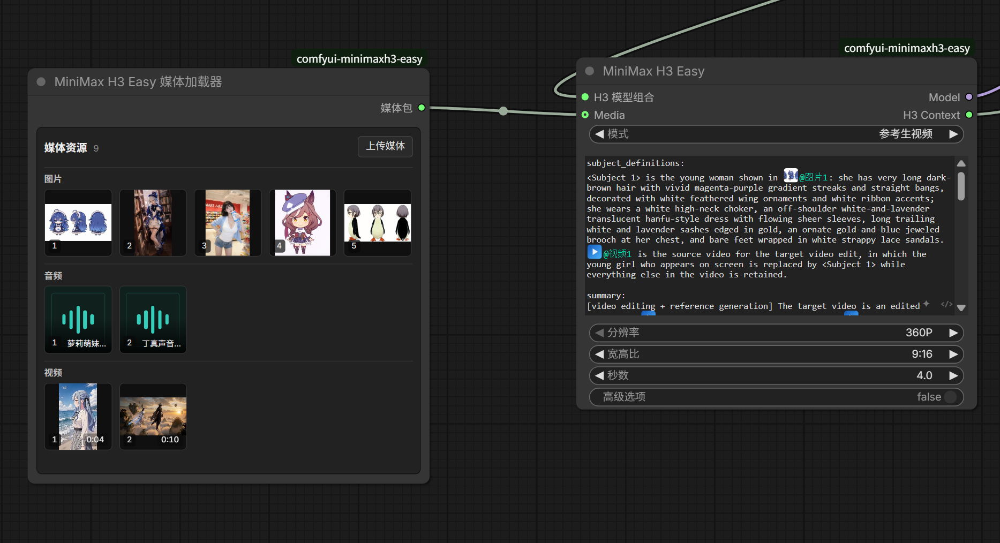
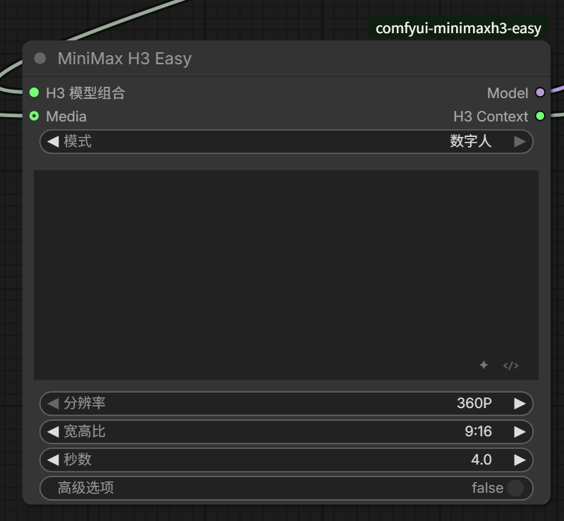
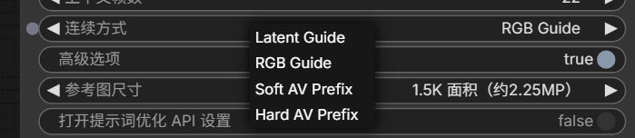
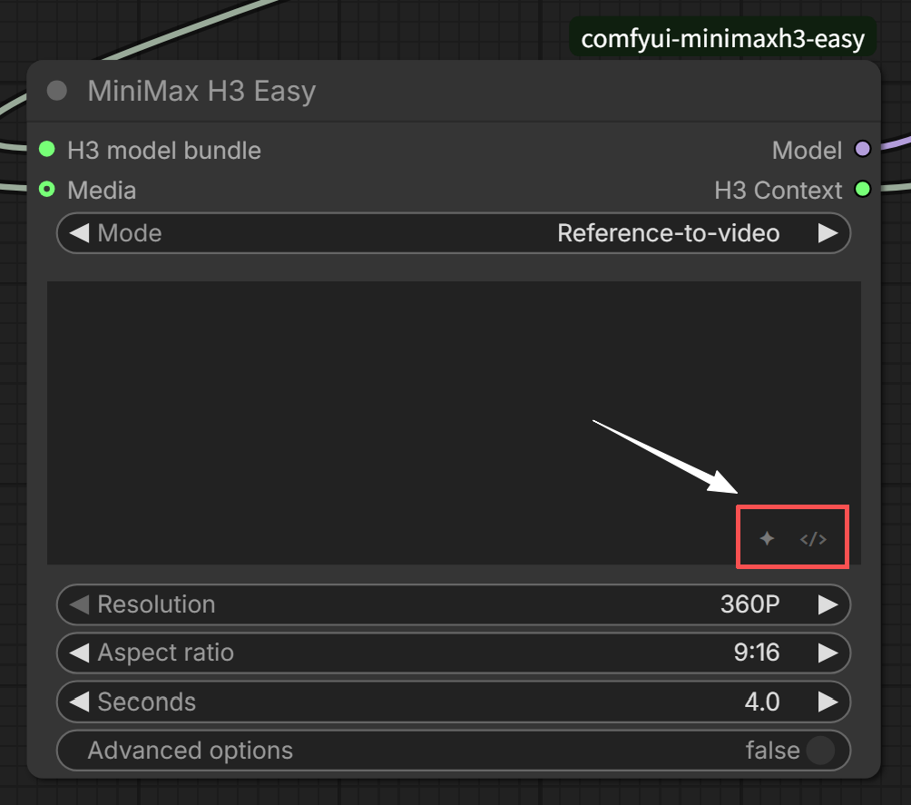
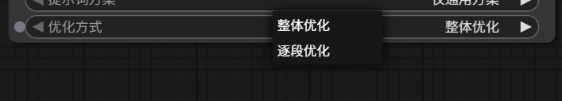

# ComfyUI-MiniMaxH3-Easy

[English README](README.md)

一套面向实际创作的 MiniMax H3 ComfyUI 节点：用更少的节点完成文生、图生、首尾帧、参考生视频、数字人和长视频上下文分段，并提供统一媒体管理、可视化素材引用、提示词优化与分段二采。

<p align="center">
  
</p>

## 主要优势

- **一个入口覆盖常用模式**：文生、图生、首尾帧、参考生视频和数字人共用同一个 Easy 主节点。
- **统一管理图片、视频和音频**：Media Loader 支持上传、拖入、粘贴、预览、排序、替换和删除，视频缩略图直接显示时长。
- **提示词直接引用素材**：输入 `@` 即可插入图片、视频或音频引用，不必手写 `<Picture N>` 等标签。
- **长视频分段生成**：每段可使用独立提示词和参考素材，同时把上一段的画面或音视频上下文传给下一段。
- **内置分段二采**：支持 Pixel Resize、3D Latent Upscale，以及显存不足时的 Low VRAM Tile。
- **保持 ComfyUI 的可组合性**：采样器、LoRA、注意力优化、解码和保存仍可自由连接。

## 安装

请先更新到包含 MiniMax H3 官方节点的较新版本 ComfyUI。

在 `ComfyUI/custom_nodes` 中安装：

```bash
git clone https://github.com/nkxx188/ComfyUI-MiniMaxH3-Easy.git
```

也可以通过 ComfyUI Manager 搜索 `ComfyUI-MiniMaxH3-Easy` 安装。**请在版本选择中安装 Nightly 版本，Nightly 才是当前最新版**；其他发布版本可能落后于本仓库。安装或更新 Python 文件后请重启 ComfyUI。

常规模型放入：

```text
ComfyUI/models/diffusion_models/
ComfyUI/models/text_encoders/
ComfyUI/models/vae/
```

使用 Latent Upscale 二采时，将对应的 H3 3D latent 放大模型放入：

```text
ComfyUI/models/latent_upscale_models/
```

Easy Loader 可以直接选择 FL2VA、Ref2VA、文本编码器和两个 VAE。模型加载器已经取消文件名白名单和命名筛选，会显示 ComfyUI 对应模型目录中的全部可用文件；请根据模型用途选择正确的文件。如果希望使用其他原生、社区或 GGUF 加载器，也可以通过 **MiniMax H3 Easy Model Adapter** 接入。

## 快速开始

最快的方式是导入 [`workflow/1.MiniMax_H3_Easy.json`](workflow/1.MiniMax_H3_Easy.json)，然后：

1. 在 **MiniMax H3 Easy Loader** 中选择模型；
2. 在 **MiniMax H3 Easy** 中选择模式；
3. 输入提示词，并按需要连接图片、视频或音频；
4. 设置分辨率、宽高比和时长；
5. Queue 工作流。

手动搭建时，基本结构是：

```text
Easy Loader → MiniMax H3 Easy → Easy Output → 采样 / 解码 / 保存
```

主节点输出的 `Model` 可继续连接 LoRA、模型补丁或采样器；`H3 Context` 连接 **MiniMax H3 Easy Output**。

## 生成模式

| 目标 | 模式与输入 |
|---|---|
| 文生视频 | 选择“图生或首尾帧”或“参考生视频”，不连接任何媒体 |
| 图生视频 | 选择“图生或首尾帧”，连接 1 张图片 |
| 首尾帧视频 | 选择“图生或首尾帧”，连接 2 张图片 |
| 参考生视频 | 选择“参考生视频”，连接图片、视频或独立音频；必须至少有一张图片或一个视频 |
| 数字人 | 选择“数字人”，连接视觉参考和且仅一条驱动音频 |

首尾帧图片会按目标画布进行必要的中心裁切，不会被横向或纵向拉伸。

“图生或首尾帧”和“参考生视频”两种模式在没有连接任何素材时都会自动走文生视频，不需要为了文生单独切换到固定模式。

当 Loader 同时配置 FL2VA 和 Ref2VA 时，普通文生/图生优先使用 FL2VA，完整参考生视频优先使用 Ref2VA；只配置一个模型时，该模型会承担所有模式。

### 数字人

数字人模式会把 Media 中唯一的一条音频作为驱动音轨锁定到生成结果，不再把它当成普通参考音频。视觉参考可以是图片或视频；如果没有提供音频，节点会自动退回普通参考生视频，不会直接报错。

<p align="center">
  
</p>

## 媒体与提示词

### 四种媒体输入方式

| 方式 | 适合场景 |
|---|---|
| **Media Loader** | 推荐的日常用法；集中管理素材，并支持视频参考解码缓存 |
| **直接连接 Media 口** | 从普通图片、视频、音频节点直接连接；同一个可见端口支持多条虚拟连线 |
| **Media Bridge** | 工作流 API、无头运行或需要显式输入口的工作流 |
| **Media Splitter** | 将 Media Bundle 拆成可接入其他工作流的独立图片、视频和音频输出 |

Media Loader 支持从资源管理器直接拖入图片、视频和音频，也可以在单独选中该节点后使用 `Ctrl+V` 粘贴剪贴板中的媒体。拖入或粘贴的素材会自动归入对应分类。

Media Loader 本身可以保存较大的素材库，实际数量限制由使用它的 Easy 或 Context Segments 节点检查。**四种方式中，只有 Media Loader 会缓存视频参考的解码结果**：同一个视频首次解码后，后续生成可通过 ComfyUI 的节点缓存直接复用，从而减少重复使用视频参考时的加载和解码时间。更换文件或文件内容变化后缓存会自动失效。直接连接 Media 口、Media Bridge 和 Media Splitter 不提供这项视频解码缓存；它节省的是生成前的视频处理时间，不会缩短模型本身的采样时间。

`Media Splitter` 是 Media Loader / Media Bridge 的反向工具：把一个 `Media Bundle` 拆成标准的 `IMAGE`、`VIDEO`、`AUDIO` 输出。设置三类数量后，节点只显示对应数量的输出口；不需要的输出不会占用画布空间，适合把同一套素材分给其他 ComfyUI 工作流。

直接连接 Media 口时，可以从端口拖到空白画布快速创建媒体节点，也可以点击虚拟连线编号删除对应素材。

<p align="center">
  
</p>

### `@` 素材引用

在参考生视频或上下文提示词中输入 `@`，即可选择已经连接的图片、视频或音频。界面可以按序号或文件名显示引用，运行时会自动转换为 H3 需要的标签。

图片、视频和音频分别独立编号。例如 `@图片1`、`@视频1` 和 `@音频1` 可以同时存在。

<p align="center">
  
</p>

### 台词块与原始视图

输入 `#` 可以创建台词块，运行时自动转换为 `<d>...</d>`。编辑器右下角的按钮用于提示词优化和结构化/原始提示词视图切换。

<p align="center">
  
</p>

提示词参数也可以转换为普通 `STRING` 输入。连接外部文本后，节点内编辑器会进入只读状态，并以外部字符串为准。

## 上下文分段长视频

上下文分段把一条长视频拆成多个连续片段。每段保留自己的提示词、时长和参考素材，同时从上一段取得连续性信息。

最基本的链路是：

```text
Context Segments → Segment Sample → Segment Decode → 第一采视频
                         ↓
                  Segment Refine → Segment Decode → 二采视频
```

### 基本用法

1. 用单独一行 `---` 分隔每段提示词；在结构化编辑器中输入 `~` 会自动插入这个分隔符；
2. 在“分段秒数”中填写对应时长，例如 `5,5,5`；
3. 通过 `@` 为各段指定需要的媒体；
4. 选择连续方式和上下文帧数；
5. 将 `H3 Context` 连接到 **Segment Sample**。

普通第一采工作流：

- [`4.MiniMax_H3_Easy_Context_Segments.json`](workflow/4.MiniMax_H3_Easy_Context_Segments.json)

### 逐段控制（可选）

如果只想一条链完成所有分段，直接使用 **Segment Sample** 即可。需要逐段调整 Seed、临时替换某段提示词，或以后只重跑受影响的分段时，可使用 [`7.MiniMax_H3_Easy_Context_Segments_Control.json`](workflow/7.MiniMax_H3_Easy_Context_Segments_Control.json)。它用 **MiniMax H3 Easy Sample Setup** 接收一次公共的 Context、Model、SAMPLER 和 SIGMAS，再把多个 **Segment Step** 串联起来；第一次运行仍会完整生成，局部重跑只是额外能力。

第一个 Step 接 Setup，后续 Step 只连接 `Previous segment`，分段顺序由连线自动确定。每个 Step 都有自己的 Seed，`Prompt override` 是可选输入；不连接时继续使用 Context Segments 中的分段提示词和 `@` 素材。示例工作流放了 3 个 Step，可按需要增加或减少。

### 分段提示词与参考媒体

所有连接到 Context Segments 的素材组成一个共享素材库，但不会自动全部参与每一段。**每个分段只会直接使用该段提示词中通过 `@` 明确引用的图片、视频或音频**；引用不会从上一段继承。同一份素材需要用于多段时，应在每个相关分段中再次 `@` 引用。

未被当前分段引用的素材不会送入该段生成，避免不同片段的参考内容互相干扰。编辑器会在运行时把 `@` 引用转换为 H3 所需的标签，并按当前分段使用的素材重新编号；即使某段没有直接引用素材，所选连续方式仍会把上一段的上下文传给它。

### 连续方式

| 连续方式 | 作用 | 可用上下文帧数 |
|---|---|---|
| **Latent Guide** | 直接传递上一段的视频 latent，通常是最适合先尝试的模式 | `5 / 22 / 39 / 56 / 73` |
| **RGB Guide** | 将上一段尾帧作为多帧视觉 Guide 重新编码 | `5 / 22 / 39 / 56 / 73` |
| **Soft AV Prefix** | 同时传递画面和音频前缀，并柔和释放音频边界 | `39 / 90 / 141` |
| **Hard AV Prefix** | 严格保持画面和音频的重叠前缀 | `39 / 90 / 141` |

<p align="center">
  
</p>

如果更重视说话人或歌手声音的连续性，优先使用 AV Prefix，或提供明确的音频参考。单纯的 RGB Guide 主要传递视觉边界，不能可靠锁定音色。

Context Segments 也支持数字人音频模式：连接且仅连接一条音频后，它会按整条时间线自动切片，并作为最终完整音轨。

### 分段二采

**MiniMax H3 Easy Segment Refine** 会逐段放大和重新采样，并继续把上一段二采结果传给下一段，因此不会把不同段的提示词和参考素材混在一起。

- **Pixel Resize**：先解码、缩放、再编码；不需要 latent 放大模型。
- **Latent Upscale**：使用内置 3D latent 放大节点，避免以像素缩放作为放大步骤。
- **Low VRAM Tile**：将当前片段按空间切块二采，以更多耗时换取更低显存占用。

对应示例：

- [`6.MiniMax_H3_Easy_Context_Segments_Pixel_Refine.json`](workflow/6.MiniMax_H3_Easy_Context_Segments_Pixel_Refine.json)
- [`5.MiniMax_H3_Easy_Context_Segments_Latent_Refine.json`](workflow/5.MiniMax_H3_Easy_Context_Segments_Latent_Refine.json)

Segment Decode 会逐段解码并写入临时视频文件，最终输出带音频的完整 ComfyUI `VIDEO`，因此不需要在内存中保留整条 RGB 视频。

## 提示词优化

在节点的“高级选项”中开启提示词优化，并直接填写 API 格式、地址、Key 和模型名。点击提示词编辑器右下角的 `✦` 可以手动优化，也可以开启“运行工作流时自动优化”。支持的 API 格式包括：

- OpenAI-compatible Chat Completions；
- OpenAI Responses；
- Gemini Native。

优化器还支持：

- 可选读取已连接媒体；
- 按生成模式加载对应的 MiniMax H3 Prompt Guide。

<p align="center">
  
</p>

### Context Segments 的专用优化

“分段秒数”同时决定优化器需要输出多少段。例如填写 `5,5,5` 时，可以只在输入框中写一整段故事或创意，再点击 `✦`（或开启运行时自动优化），优化器会把它规划成 **3 段**独立提示词，并自动用 `---` 分隔。

- **整体优化**：一次理解整条视频。既可以把一整段创意拆成开端、发展和结尾，也可以整体润色已经分好的脚本，同时保留各段原有动作和顺序。
- **逐段优化**：适合已经写好的多个分段。它会按设置的并发数分别优化，每次只改当前段；前面各段仅作为只读的连续性背景，不会被反复重写。

这套优化不是简单扩写：它会根据每段时长安排动作密度，保留必要的主体外观、场景、道具状态和声音线索，让每段提示词都能独立使用，同时避免输出“第 2 段”“接着上一段”这类模型无法直接利用的规划文字。开启“读取媒体”后，优化器还会保留或分配真正需要的 `@` 引用；最终生成时仍严格遵守“每段只使用本段引用素材”的规则。

自动优化会记录已经处理过的提示词；当提示词、优化设置和媒体都没有变化时，不会在每次运行时重复改写。

<p align="center">
  
</p>

API 设置随各自节点保存在工作流中，复制工作流时不需要重新配置；但 API Key 也会以明文写入工作流 JSON，分享或公开工作流前请先清空 Key。

## 节点一览

| 节点 | 用途 |
|---|---|
| MiniMax H3 Easy Loader | 选择 H3 模型、文本编码器和两个 VAE |
| MiniMax H3 Easy Model Adapter | 接入外部 MODEL、CLIP 和 VAE 加载器 |
| MiniMax H3 Easy Media Loader | 可视化管理图片、音频和视频 |
| MiniMax H3 Easy Media Bridge | 为 API 或无头工作流提供显式媒体输入 |
| MiniMax H3 Easy Media Splitter | 将 Media Bundle 拆成独立的 IMAGE、VIDEO 和 AUDIO 输出；最多 27 张图片、9 个视频和 9 个音频 |
| MiniMax H3 Easy | 普通生成、参考生成与数字人 |
| MiniMax H3 Easy Output | 将 H3 Context 展开为标准 Conditioning、Latent、VAE、FPS 和驱动音频 |
| MiniMax H3 Easy Context Segments | 创建长视频分段计划 |
| MiniMax H3 Easy Segment Sample | 执行分段第一采 |
| MiniMax H3 Easy Sample Setup | 为逐段控制工作流提供一次公共采样设置 |
| MiniMax H3 Easy Segment Step | 处理单个分段；可独立设置 Seed 和提示词覆盖 |
| MiniMax H3 Easy Segment Collect | 汇总串联后的分段结果 |
| MiniMax H3 Easy Segment Refine | 执行 Pixel 或 Latent 分段二采 |
| MiniMax H3 Easy Segment Decode | 流式解码并输出完整 VIDEO |
| MiniMax H3 Easy Aspect Ratio | 将一采宽高比传给下游分辨率节点 |
| MiniMax H3 Easy Second Pass Conditioning | 为传统外部二采重建分辨率相关条件 |
| MiniMax H3 Easy 3D Latent Upscale | 内置 H3 视频 latent 放大节点 |

## 使用限制与注意事项

- 普通参考生视频每次最多使用 9 张图片、3 个视频和 3 条独立音频，总数最多 15。
- Context Segments 的共享媒体库最多支持 27 张图片、9 个视频和 9 条音频；每个片段仍遵守普通单次参考限制。
- 数字人模式只能使用一条驱动音频。
- Media Loader 缓存的是解码后的帧；长时间、高分辨率参考视频可能占用较多系统内存。
- 常规的 Segment Sample 和 Segment Refine 当前每次 Queue 都会重新执行，即使 Seed 和输入没有变化；逐段控制工作流中的 Segment Step 可以利用 ComfyUI 原生缓存复用未改变的前置分段。
- Segment Decode 需要可用的 FFmpeg；项目会优先使用 `imageio-ffmpeg`，也支持系统 PATH 中的 FFmpeg。
- 提示词优化是可选工具，不影响节点在未配置 API 时正常生成。

## 其他说明

- 支持经典 ComfyUI 画布和 Nodes 2.0。
- 中文浏览器显示中文界面，其他语言环境默认显示英文。
- 示例工作流位于 [`workflow`](workflow) 目录；不同工作流可能需要额外模型、LoRA 或自定义节点。

## 致谢

上下文连续生成的设计思路受到 [NikoDemon80/ComfyUI-H3-Motion-Context](https://github.com/NikoDemon80/ComfyUI-H3-Motion-Context) 及其衍生项目 [ethanfel/ComfyUI-MiniMaxH3-Contex-Loop](https://github.com/ethanfel/ComfyUI-MiniMaxH3-Contex-Loop) 的启发，代码与节点实现均独立完成。

## License 与署名

本项目使用 [MIT License](LICENSE)。

如果项目中复用或改编了本项目较多代码或重要实现，请在项目说明中注明 `ComfyUI-MiniMaxH3-Easy` 及原作者，并请勿将复用的部分声明为完全独立原创。少量参考、普通调用或仅使用本节点不受此署名说明约束。
